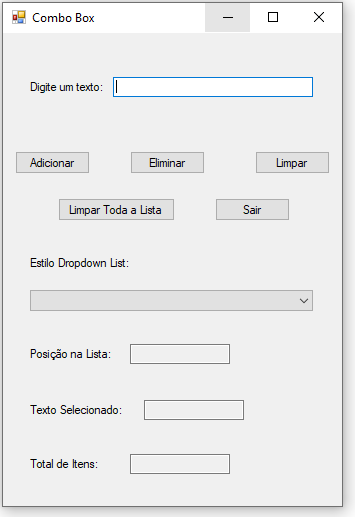
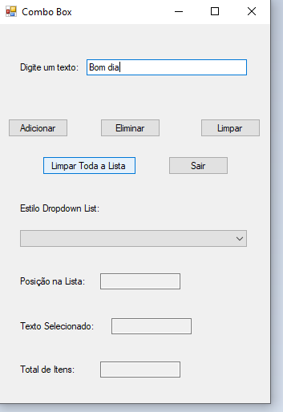
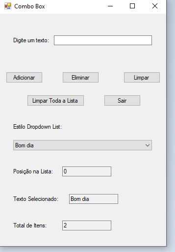
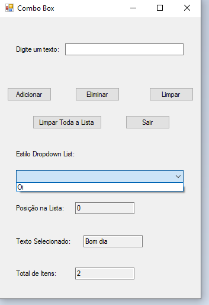
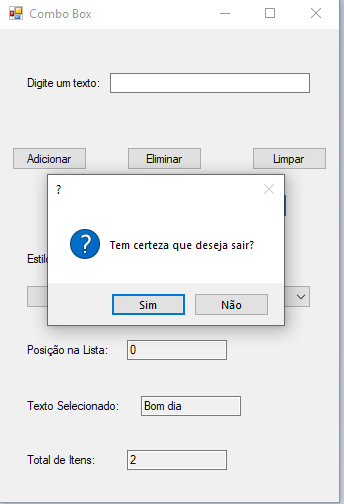

# aulaComboBoxCSharp
treinando combobox no visual studio com C#. Aula na ETEC de Guarulhos.
  

  <h3>Programa normal para aprender a usar a combo box.</h3>
    

  

  <h3>Aqui eu selecionei o texto que eu inseri e deletei ele.</h3>
    

  

  <h3>Um botão pra sair.</h3>
  

